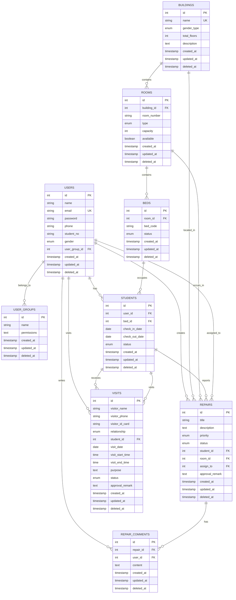

# 宿舍管理系统数据库设计文档

## 1. 数据库概述

### 1.1 设计原则
- **规范化设计**：遵循第三范式，减少数据冗余
- **性能优化**：合理设置索引，优化查询性能
- **扩展性**：预留扩展字段，支持业务发展
- **数据完整性**：通过约束保证数据一致性
- **安全性**：敏感数据加密，访问权限控制

### 1.2 命名规范
- **表名**：使用复数形式，如 `users`、`buildings`
- **字段名**：使用下划线分隔，如 `created_at`、`user_id`
- **索引名**：`idx_表名_字段名`，如 `idx_users_email`
- **外键名**：`fk_表名_字段名`，如 `fk_rooms_building_id`

## 2. 数据库E-R图



## 3. 数据表详细设计

### 3.1 用户表 (users)

| 字段名 | 数据类型 | 长度 | 是否为空 | 默认值 | 说明 |
|--------|----------|------|----------|--------|------|
| id | INT | - | NOT NULL | AUTO_INCREMENT | 主键，用户ID |
| name | VARCHAR | 100 | NOT NULL | - | 用户姓名 |
| email | VARCHAR | 255 | NOT NULL | - | 邮箱地址，唯一 |
| password | VARCHAR | 255 | NOT NULL | - | 密码（加密） |
| phone | VARCHAR | 20 | NULL | - | 手机号码 |
| student_no | VARCHAR | 50 | NULL | - | 学号 |
| gender | ENUM | - | NULL | - | 性别：M(男),F(女) |
| user_group_id | INT | - | NOT NULL | 1 | 用户组ID，外键 |
| created_at | TIMESTAMP | - | NOT NULL | CURRENT_TIMESTAMP | 创建时间 |
| updated_at | TIMESTAMP | - | NOT NULL | CURRENT_TIMESTAMP ON UPDATE | 更新时间 |
| deleted_at | TIMESTAMP | - | NULL | - | 软删除时间 |

**索引设计：**
- PRIMARY KEY: `id`
- UNIQUE KEY: `email`
- INDEX: `idx_users_student_no`
- INDEX: `idx_users_user_group_id`
- INDEX: `idx_users_deleted_at`

### 3.2 用户组表 (user_groups)

| 字段名 | 数据类型 | 长度 | 是否为空 | 默认值 | 说明 |
|--------|----------|------|----------|--------|------|
| id | INT | - | NOT NULL | AUTO_INCREMENT | 主键，用户组ID |
| name | VARCHAR | 100 | NOT NULL | - | 用户组名称 |
| permissions | TEXT | - | NULL | - | 权限列表（JSON格式） |
| created_at | TIMESTAMP | - | NOT NULL | CURRENT_TIMESTAMP | 创建时间 |
| updated_at | TIMESTAMP | - | NOT NULL | CURRENT_TIMESTAMP ON UPDATE | 更新时间 |
| deleted_at | TIMESTAMP | - | NULL | - | 软删除时间 |

**索引设计：**
- PRIMARY KEY: `id`
- UNIQUE KEY: `name`
- INDEX: `idx_user_groups_deleted_at`

### 3.3 楼栋表 (buildings)

| 字段名 | 数据类型 | 长度 | 是否为空 | 默认值 | 说明 |
|--------|----------|------|----------|--------|------|
| id | INT | - | NOT NULL | AUTO_INCREMENT | 主键，楼栋ID |
| name | VARCHAR | 100 | NOT NULL | - | 楼栋名称，唯一 |
| gender_type | ENUM | - | NOT NULL | - | 性别类型：M(男寝),F(女寝),U(混合) |
| total_floors | INT | - | NOT NULL | 1 | 总楼层数 |
| description | TEXT | - | NULL | - | 楼栋描述 |
| created_at | TIMESTAMP | - | NOT NULL | CURRENT_TIMESTAMP | 创建时间 |
| updated_at | TIMESTAMP | - | NOT NULL | CURRENT_TIMESTAMP ON UPDATE | 更新时间 |
| deleted_at | TIMESTAMP | - | NULL | - | 软删除时间 |

**索引设计：**
- PRIMARY KEY: `id`
- UNIQUE KEY: `name`
- INDEX: `idx_buildings_gender_type`
- INDEX: `idx_buildings_deleted_at`

### 3.4 房间表 (rooms)

| 字段名 | 数据类型 | 长度 | 是否为空 | 默认值 | 说明 |
|--------|----------|------|----------|--------|------|
| id | INT | - | NOT NULL | AUTO_INCREMENT | 主键，房间ID |
| building_id | INT | - | NOT NULL | - | 楼栋ID，外键 |
| room_number | VARCHAR | 20 | NOT NULL | - | 房间号 |
| type | ENUM | - | NOT NULL | STANDARD | 房间类型：STANDARD(标准间),SUITE(套间) |
| capacity | INT | - | NOT NULL | 4 | 房间容量 |
| available | BOOLEAN | - | NOT NULL | TRUE | 是否可用 |
| created_at | TIMESTAMP | - | NOT NULL | CURRENT_TIMESTAMP | 创建时间 |
| updated_at | TIMESTAMP | - | NOT NULL | CURRENT_TIMESTAMP ON UPDATE | 更新时间 |
| deleted_at | TIMESTAMP | - | NULL | - | 软删除时间 |

**索引设计：**
- PRIMARY KEY: `id`
- INDEX: `idx_rooms_building_id`
- UNIQUE KEY: `uk_rooms_building_room` (building_id, room_number)
- INDEX: `idx_rooms_type`
- INDEX: `idx_rooms_available`
- INDEX: `idx_rooms_deleted_at`

### 3.5 床位表 (beds)

| 字段名 | 数据类型 | 长度 | 是否为空 | 默认值 | 说明 |
|--------|----------|------|----------|--------|------|
| id | INT | - | NOT NULL | AUTO_INCREMENT | 主键，床位ID |
| room_id | INT | - | NOT NULL | - | 房间ID，外键 |
| bed_code | VARCHAR | 10 | NOT NULL | - | 床位编号 |
| status | ENUM | - | NOT NULL | FREE | 床位状态：FREE(空闲),OCCUPIED(已占用),MAINTENANCE(维护中) |
| created_at | TIMESTAMP | - | NOT NULL | CURRENT_TIMESTAMP | 创建时间 |
| updated_at | TIMESTAMP | - | NOT NULL | CURRENT_TIMESTAMP ON UPDATE | 更新时间 |
| deleted_at | TIMESTAMP | - | NULL | - | 软删除时间 |

**索引设计：**
- PRIMARY KEY: `id`
- INDEX: `idx_beds_room_id`
- UNIQUE KEY: `uk_beds_room_bed` (room_id, bed_code)
- INDEX: `idx_beds_status`
- INDEX: `idx_beds_deleted_at`

### 3.6 学生住宿表 (students)

| 字段名 | 数据类型 | 长度 | 是否为空 | 默认值 | 说明 |
|--------|----------|------|----------|--------|------|
| id | INT | - | NOT NULL | AUTO_INCREMENT | 主键，住宿记录ID |
| user_id | INT | - | NOT NULL | - | 用户ID，外键 |
| bed_id | INT | - | NOT NULL | - | 床位ID，外键 |
| check_in_date | DATE | - | NOT NULL | - | 入住日期 |
| check_out_date | DATE | - | NULL | - | 退宿日期 |
| status | ENUM | - | NOT NULL | LIVING | 住宿状态：LIVING(在住),CHECKED_OUT(已退宿) |
| created_at | TIMESTAMP | - | NOT NULL | CURRENT_TIMESTAMP | 创建时间 |
| updated_at | TIMESTAMP | - | NOT NULL | CURRENT_TIMESTAMP ON UPDATE | 更新时间 |
| deleted_at | TIMESTAMP | - | NULL | - | 软删除时间 |

**索引设计：**
- PRIMARY KEY: `id`
- INDEX: `idx_students_user_id`
- INDEX: `idx_students_bed_id`
- INDEX: `idx_students_status`
- INDEX: `idx_students_check_in_date`
- INDEX: `idx_students_deleted_at`

### 3.7 维修工单表 (repairs)

| 字段名 | 数据类型 | 长度 | 是否为空 | 默认值 | 说明 |
|--------|----------|------|----------|--------|------|
| id | INT | - | NOT NULL | AUTO_INCREMENT | 主键，工单ID |
| title | VARCHAR | 200 | NOT NULL | - | 工单标题 |
| description | TEXT | - | NOT NULL | - | 问题描述 |
| priority | ENUM | - | NOT NULL | MEDIUM | 优先级：LOW(低),MEDIUM(中),HIGH(高),URGENT(紧急) |
| status | ENUM | - | NOT NULL | PENDING | 状态：PENDING(待处理),PROCESSING(处理中),COMPLETED(已完成) |
| student_id | INT | - | NOT NULL | - | 提交学生ID，外键 |
| room_id | INT | - | NOT NULL | - | 房间ID，外键 |
| assign_to | INT | - | NULL | - | 分配给维修人员ID，外键 |
| approval_remark | TEXT | - | NULL | - | 处理备注 |
| created_at | TIMESTAMP | - | NOT NULL | CURRENT_TIMESTAMP | 创建时间 |
| updated_at | TIMESTAMP | - | NOT NULL | CURRENT_TIMESTAMP ON UPDATE | 更新时间 |
| deleted_at | TIMESTAMP | - | NULL | - | 软删除时间 |

**索引设计：**
- PRIMARY KEY: `id`
- INDEX: `idx_repairs_student_id`
- INDEX: `idx_repairs_room_id`
- INDEX: `idx_repairs_assign_to`
- INDEX: `idx_repairs_status`
- INDEX: `idx_repairs_priority`
- INDEX: `idx_repairs_created_at`
- INDEX: `idx_repairs_deleted_at`

### 3.8 维修工单留言表 (repair_comments)

| 字段名 | 数据类型 | 长度 | 是否为空 | 默认值 | 说明 |
|--------|----------|------|----------|--------|------|
| id | INT | - | NOT NULL | AUTO_INCREMENT | 主键，留言ID |
| repair_id | INT | - | NOT NULL | - | 工单ID，外键 |
| user_id | INT | - | NOT NULL | - | 留言用户ID，外键 |
| content | TEXT | - | NOT NULL | - | 留言内容 |
| created_at | TIMESTAMP | - | NOT NULL | CURRENT_TIMESTAMP | 创建时间 |
| updated_at | TIMESTAMP | - | NOT NULL | CURRENT_TIMESTAMP ON UPDATE | 更新时间 |
| deleted_at | TIMESTAMP | - | NULL | - | 软删除时间 |

**索引设计：**
- PRIMARY KEY: `id`
- INDEX: `idx_repair_comments_repair_id`
- INDEX: `idx_repair_comments_user_id`
- INDEX: `idx_repair_comments_created_at`
- INDEX: `idx_repair_comments_deleted_at`

### 3.9 访客表 (visits)

| 字段名 | 数据类型 | 长度 | 是否为空 | 默认值 | 说明 |
|--------|----------|------|----------|--------|------|
| id | INT | - | NOT NULL | AUTO_INCREMENT | 主键，访客记录ID |
| visitor_name | VARCHAR | 100 | NOT NULL | - | 访客姓名 |
| visitor_phone | VARCHAR | 20 | NOT NULL | - | 访客电话 |
| visitor_id_card | VARCHAR | 18 | NOT NULL | - | 访客身份证号 |
| relationship | ENUM | - | NOT NULL | - | 与学生关系：PARENT(家长),RELATIVE(亲属),FRIEND(朋友),OTHER(其他) |
| student_id | INT | - | NOT NULL | - | 被访学生ID，外键 |
| visit_date | DATE | - | NOT NULL | - | 访问日期 |
| visit_start_time | TIME | - | NOT NULL | - | 访问开始时间 |
| visit_end_time | TIME | - | NOT NULL | - | 访问结束时间 |
| purpose | TEXT | - | NOT NULL | - | 访问目的 |
| status | ENUM | - | NOT NULL | PENDING | 状态：PENDING(待审核),APPROVED(已通过),REJECTED(已拒绝),FINISHED(已结束) |
| approval_remark | TEXT | - | NULL | - | 审核备注 |
| created_at | TIMESTAMP | - | NOT NULL | CURRENT_TIMESTAMP | 创建时间 |
| updated_at | TIMESTAMP | - | NOT NULL | CURRENT_TIMESTAMP ON UPDATE | 更新时间 |
| deleted_at | TIMESTAMP | - | NULL | - | 软删除时间 |

**索引设计：**
- PRIMARY KEY: `id`
- INDEX: `idx_visits_student_id`
- INDEX: `idx_visits_visitor_phone`
- INDEX: `idx_visits_visitor_id_card`
- INDEX: `idx_visits_visit_date`
- INDEX: `idx_visits_status`
- INDEX: `idx_visits_created_at`
- INDEX: `idx_visits_deleted_at`

## 4. 外键约束设计

```sql
-- 用户表外键
ALTER TABLE users ADD CONSTRAINT fk_users_user_group_id 
FOREIGN KEY (user_group_id) REFERENCES user_groups(id);

-- 房间表外键
ALTER TABLE rooms ADD CONSTRAINT fk_rooms_building_id 
FOREIGN KEY (building_id) REFERENCES buildings(id);

-- 床位表外键
ALTER TABLE beds ADD CONSTRAINT fk_beds_room_id 
FOREIGN KEY (room_id) REFERENCES rooms(id);

-- 学生住宿表外键
ALTER TABLE students ADD CONSTRAINT fk_students_user_id 
FOREIGN KEY (user_id) REFERENCES users(id);
ALTER TABLE students ADD CONSTRAINT fk_students_bed_id 
FOREIGN KEY (bed_id) REFERENCES beds(id);

-- 维修工单表外键
ALTER TABLE repairs ADD CONSTRAINT fk_repairs_student_id 
FOREIGN KEY (student_id) REFERENCES students(id);
ALTER TABLE repairs ADD CONSTRAINT fk_repairs_room_id 
FOREIGN KEY (room_id) REFERENCES rooms(id);
ALTER TABLE repairs ADD CONSTRAINT fk_repairs_assign_to 
FOREIGN KEY (assign_to) REFERENCES users(id);

-- 维修工单留言表外键
ALTER TABLE repair_comments ADD CONSTRAINT fk_repair_comments_repair_id 
FOREIGN KEY (repair_id) REFERENCES repairs(id);
ALTER TABLE repair_comments ADD CONSTRAINT fk_repair_comments_user_id 
FOREIGN KEY (user_id) REFERENCES users(id);

-- 访客表外键
ALTER TABLE visits ADD CONSTRAINT fk_visits_student_id 
FOREIGN KEY (student_id) REFERENCES students(id);
```

## 5. 数据库初始化脚本

```sql
-- 创建数据库
CREATE DATABASE dormitory CHARACTER SET utf8mb4 COLLATE utf8mb4_unicode_ci;

-- 使用数据库
USE dormitory;

-- 创建用户组表
CREATE TABLE user_groups (
    id INT AUTO_INCREMENT PRIMARY KEY,
    name VARCHAR(100) NOT NULL UNIQUE,
    permissions TEXT,
    created_at TIMESTAMP DEFAULT CURRENT_TIMESTAMP,
    updated_at TIMESTAMP DEFAULT CURRENT_TIMESTAMP ON UPDATE CURRENT_TIMESTAMP,
    deleted_at TIMESTAMP NULL,
    INDEX idx_user_groups_deleted_at (deleted_at)
);

-- 插入默认用户组
INSERT INTO user_groups (name, permissions) VALUES 
('管理员', '["all"]'),
('宿舍管理员', '["building", "room", "student"]'),
('维修人员', '["repair"]'),
('学生', '["student_portal"]');

-- 创建用户表
CREATE TABLE users (
    id INT AUTO_INCREMENT PRIMARY KEY,
    name VARCHAR(100) NOT NULL,
    email VARCHAR(255) NOT NULL UNIQUE,
    password VARCHAR(255) NOT NULL,
    phone VARCHAR(20),
    student_no VARCHAR(50),
    gender ENUM('M', 'F'),
    user_group_id INT NOT NULL DEFAULT 1,
    created_at TIMESTAMP DEFAULT CURRENT_TIMESTAMP,
    updated_at TIMESTAMP DEFAULT CURRENT_TIMESTAMP ON UPDATE CURRENT_TIMESTAMP,
    deleted_at TIMESTAMP NULL,
    INDEX idx_users_student_no (student_no),
    INDEX idx_users_user_group_id (user_group_id),
    INDEX idx_users_deleted_at (deleted_at),
    FOREIGN KEY (user_group_id) REFERENCES user_groups(id)
);

-- 插入默认管理员用户
INSERT INTO users (name, email, password, user_group_id) VALUES
('系统管理员', 'admin', '$2a$10$encrypted_password_hash', 1);

-- 创建其他表的完整SQL
CREATE TABLE buildings (
    id INT AUTO_INCREMENT PRIMARY KEY,
    name VARCHAR(100) NOT NULL UNIQUE,
    gender_type ENUM('M', 'F', 'U') NOT NULL,
    total_floors INT NOT NULL DEFAULT 1,
    description TEXT,
    created_at TIMESTAMP DEFAULT CURRENT_TIMESTAMP,
    updated_at TIMESTAMP DEFAULT CURRENT_TIMESTAMP ON UPDATE CURRENT_TIMESTAMP,
    deleted_at TIMESTAMP NULL,
    INDEX idx_buildings_gender_type (gender_type),
    INDEX idx_buildings_deleted_at (deleted_at)
);

CREATE TABLE rooms (
    id INT AUTO_INCREMENT PRIMARY KEY,
    building_id INT NOT NULL,
    room_number VARCHAR(20) NOT NULL,
    type ENUM('STANDARD', 'SUITE') NOT NULL DEFAULT 'STANDARD',
    capacity INT NOT NULL DEFAULT 4,
    available BOOLEAN NOT NULL DEFAULT TRUE,
    created_at TIMESTAMP DEFAULT CURRENT_TIMESTAMP,
    updated_at TIMESTAMP DEFAULT CURRENT_TIMESTAMP ON UPDATE CURRENT_TIMESTAMP,
    deleted_at TIMESTAMP NULL,
    INDEX idx_rooms_building_id (building_id),
    UNIQUE KEY uk_rooms_building_room (building_id, room_number),
    INDEX idx_rooms_type (type),
    INDEX idx_rooms_available (available),
    INDEX idx_rooms_deleted_at (deleted_at),
    FOREIGN KEY (building_id) REFERENCES buildings(id)
);

CREATE TABLE beds (
    id INT AUTO_INCREMENT PRIMARY KEY,
    room_id INT NOT NULL,
    bed_code VARCHAR(10) NOT NULL,
    status ENUM('FREE', 'OCCUPIED', 'MAINTENANCE') NOT NULL DEFAULT 'FREE',
    created_at TIMESTAMP DEFAULT CURRENT_TIMESTAMP,
    updated_at TIMESTAMP DEFAULT CURRENT_TIMESTAMP ON UPDATE CURRENT_TIMESTAMP,
    deleted_at TIMESTAMP NULL,
    INDEX idx_beds_room_id (room_id),
    UNIQUE KEY uk_beds_room_bed (room_id, bed_code),
    INDEX idx_beds_status (status),
    INDEX idx_beds_deleted_at (deleted_at),
    FOREIGN KEY (room_id) REFERENCES rooms(id)
);

CREATE TABLE students (
    id INT AUTO_INCREMENT PRIMARY KEY,
    user_id INT NOT NULL,
    bed_id INT NOT NULL,
    check_in_date DATE NOT NULL,
    check_out_date DATE NULL,
    status ENUM('LIVING', 'CHECKED_OUT') NOT NULL DEFAULT 'LIVING',
    created_at TIMESTAMP DEFAULT CURRENT_TIMESTAMP,
    updated_at TIMESTAMP DEFAULT CURRENT_TIMESTAMP ON UPDATE CURRENT_TIMESTAMP,
    deleted_at TIMESTAMP NULL,
    INDEX idx_students_user_id (user_id),
    INDEX idx_students_bed_id (bed_id),
    INDEX idx_students_status (status),
    INDEX idx_students_check_in_date (check_in_date),
    INDEX idx_students_deleted_at (deleted_at),
    FOREIGN KEY (user_id) REFERENCES users(id),
    FOREIGN KEY (bed_id) REFERENCES beds(id)
);

CREATE TABLE repairs (
    id INT AUTO_INCREMENT PRIMARY KEY,
    title VARCHAR(200) NOT NULL,
    description TEXT NOT NULL,
    priority ENUM('LOW', 'MEDIUM', 'HIGH', 'URGENT') NOT NULL DEFAULT 'MEDIUM',
    status ENUM('PENDING', 'PROCESSING', 'COMPLETED') NOT NULL DEFAULT 'PENDING',
    student_id INT NOT NULL,
    room_id INT NOT NULL,
    assign_to INT NULL,
    approval_remark TEXT NULL,
    created_at TIMESTAMP DEFAULT CURRENT_TIMESTAMP,
    updated_at TIMESTAMP DEFAULT CURRENT_TIMESTAMP ON UPDATE CURRENT_TIMESTAMP,
    deleted_at TIMESTAMP NULL,
    INDEX idx_repairs_student_id (student_id),
    INDEX idx_repairs_room_id (room_id),
    INDEX idx_repairs_assign_to (assign_to),
    INDEX idx_repairs_status (status),
    INDEX idx_repairs_priority (priority),
    INDEX idx_repairs_created_at (created_at),
    INDEX idx_repairs_deleted_at (deleted_at),
    FOREIGN KEY (student_id) REFERENCES students(id),
    FOREIGN KEY (room_id) REFERENCES rooms(id),
    FOREIGN KEY (assign_to) REFERENCES users(id)
);

CREATE TABLE repair_comments (
    id INT AUTO_INCREMENT PRIMARY KEY,
    repair_id INT NOT NULL,
    user_id INT NOT NULL,
    content TEXT NOT NULL,
    created_at TIMESTAMP DEFAULT CURRENT_TIMESTAMP,
    updated_at TIMESTAMP DEFAULT CURRENT_TIMESTAMP ON UPDATE CURRENT_TIMESTAMP,
    deleted_at TIMESTAMP NULL,
    INDEX idx_repair_comments_repair_id (repair_id),
    INDEX idx_repair_comments_user_id (user_id),
    INDEX idx_repair_comments_created_at (created_at),
    INDEX idx_repair_comments_deleted_at (deleted_at),
    FOREIGN KEY (repair_id) REFERENCES repairs(id),
    FOREIGN KEY (user_id) REFERENCES users(id)
);

CREATE TABLE visits (
    id INT AUTO_INCREMENT PRIMARY KEY,
    visitor_name VARCHAR(100) NOT NULL,
    visitor_phone VARCHAR(20) NOT NULL,
    visitor_id_card VARCHAR(18) NOT NULL,
    relationship ENUM('PARENT', 'RELATIVE', 'FRIEND', 'OTHER') NOT NULL,
    student_id INT NOT NULL,
    visit_date DATE NOT NULL,
    visit_start_time TIME NOT NULL,
    visit_end_time TIME NOT NULL,
    purpose TEXT NOT NULL,
    status ENUM('PENDING', 'APPROVED', 'REJECTED', 'FINISHED') NOT NULL DEFAULT 'PENDING',
    approval_remark TEXT NULL,
    created_at TIMESTAMP DEFAULT CURRENT_TIMESTAMP,
    updated_at TIMESTAMP DEFAULT CURRENT_TIMESTAMP ON UPDATE CURRENT_TIMESTAMP,
    deleted_at TIMESTAMP NULL,
    INDEX idx_visits_student_id (student_id),
    INDEX idx_visits_visitor_phone (visitor_phone),
    INDEX idx_visits_visitor_id_card (visitor_id_card),
    INDEX idx_visits_visit_date (visit_date),
    INDEX idx_visits_status (status),
    INDEX idx_visits_created_at (created_at),
    INDEX idx_visits_deleted_at (deleted_at),
    FOREIGN KEY (student_id) REFERENCES students(id)
);
```

## 6. 数据库性能优化建议

### 6.1 索引优化策略
- **主键索引**：所有表都使用自增主键，提供最佳的插入性能
- **唯一索引**：用于保证数据唯一性，如用户邮箱、楼栋名称等
- **复合索引**：针对多字段查询场景，如楼栋+房间号的组合查询
- **覆盖索引**：包含查询所需的所有字段，减少回表操作

### 6.2 查询优化
```sql
-- 高效的分页查询
SELECT * FROM students
WHERE deleted_at IS NULL
ORDER BY id DESC
LIMIT 20 OFFSET 0;

-- 使用索引的范围查询
SELECT * FROM visits
WHERE visit_date BETWEEN '2024-01-01' AND '2024-01-31'
AND status = 'APPROVED';

-- 连接查询优化
SELECT s.*, u.name, u.student_no, r.room_number, b.name as building_name
FROM students s
JOIN users u ON s.user_id = u.id
JOIN beds bed ON s.bed_id = bed.id
JOIN rooms r ON bed.room_id = r.id
JOIN buildings b ON r.building_id = b.id
WHERE s.status = 'LIVING' AND s.deleted_at IS NULL;
```

### 6.3 分区策略
对于大数据量表，可以考虑分区：
```sql
-- 按时间分区的访客表
CREATE TABLE visits_partitioned (
    -- 字段定义同visits表
) PARTITION BY RANGE (YEAR(visit_date)) (
    PARTITION p2023 VALUES LESS THAN (2024),
    PARTITION p2024 VALUES LESS THAN (2025),
    PARTITION p2025 VALUES LESS THAN (2026),
    PARTITION p_future VALUES LESS THAN MAXVALUE
);
```

## 7. 数据备份与恢复策略

### 7.1 备份策略
- **全量备份**：每日凌晨进行完整数据库备份
- **增量备份**：每小时备份binlog增量数据
- **异地备份**：备份文件同步到远程存储

### 7.2 恢复测试
定期进行数据恢复演练，确保备份文件的可用性。
```
